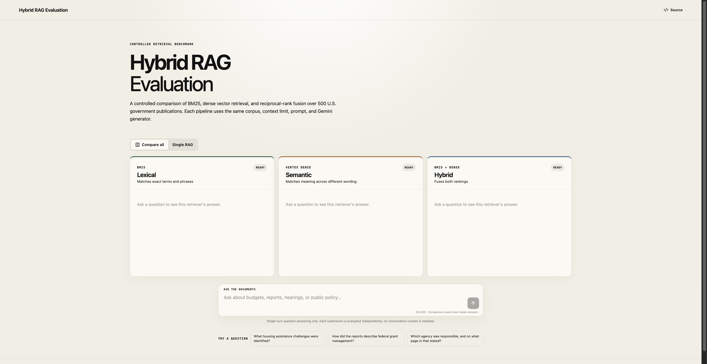
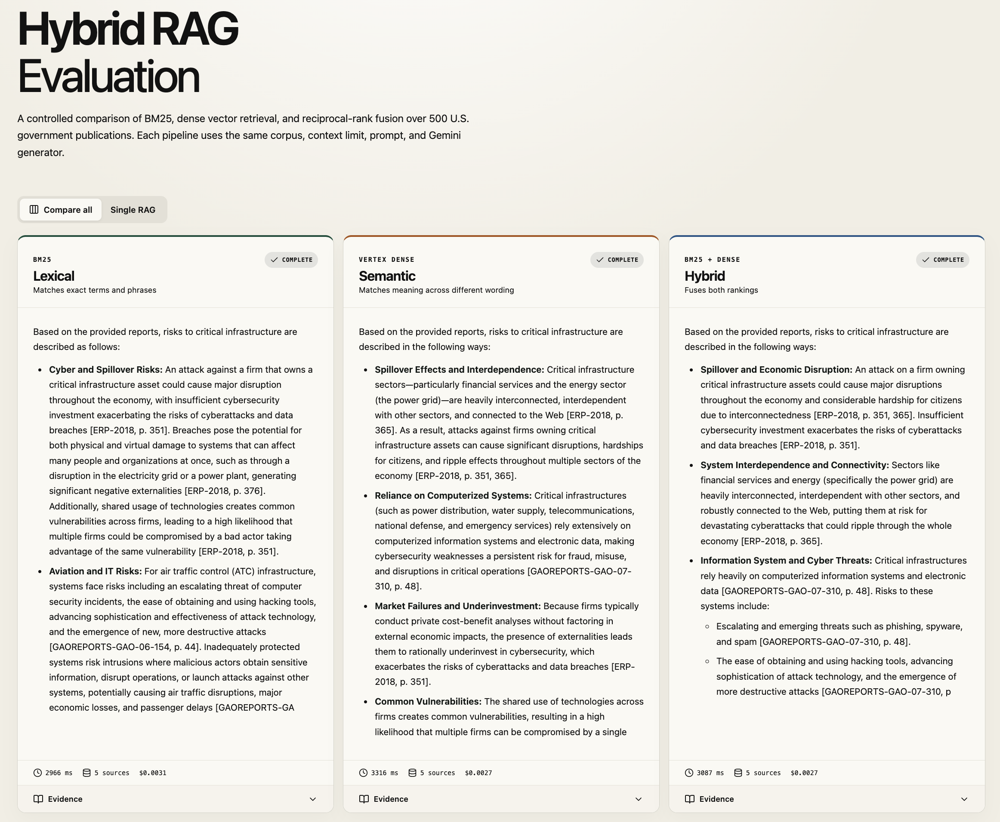

# Hybrid RAG Evaluation

A production-deployed comparison of lexical, semantic, and hybrid retrieval over
500 searchable U.S. government publications. The application sends one question
through each selected retrieval pipeline and uses the same Gemini Flash model,
prompt, evidence limit, and answer format so retrieval strategy remains the
primary experimental variable.

**[Open the live demo](https://govlens-265050340558.us-central1.run.app)**



- **Lexical:** SQLite FTS5/BM25 for exact terms, names, dates, and citations.
- **Semantic:** exact cosine search over 768-dimensional Vertex AI embeddings.
- **Hybrid:** reciprocal-rank fusion of the BM25 and dense rankings.

The interface is intentionally single-turn: it retains no conversational
context, offers 30 curated GovInfo questions as a rotating set of three
suggestions, streams each answer independently, and exposes the retrieved
evidence behind every result. Users can compare all three systems or run one
retriever to reduce generation cost.



The deployment uses Cloud Run scale-to-zero, Firestore-backed quotas, and an
application-level daily model budget. The deployment script is private by
default; public access must be enabled explicitly. Health, configuration,
single-system generation, comparison streaming, quota, and citation paths have
passed automated smoke tests. Published quality results are automated because
the generated human-review worksheet has not yet been completed.

## What this project demonstrates

- A controlled RAG experiment with a shared corpus, chunking strategy, generator,
  prompt, context limit, and citation contract.
- Exact in-memory vector search over 109,226 normalized Vertex AI embeddings,
  without the fixed cost of a managed vector database.
- Concurrent SSE streaming with isolated failures, evidence inspection, and
  anonymous answer-preference feedback.
- Reproducible retrieval and answer evaluation with confidence intervals,
  blinded judging, token usage, latency, and measured cost.
- A cost-capped public deployment with least-privilege runtime identity,
  cross-instance quotas, structured logging, and no stored questions or answers.

## Architecture

```text
React comparison UI
        |
FastAPI SSE endpoint -- Firestore quota transaction
        |
single-turn query shared by all retrievers
        |
  +-----+--------------------+
  |                          |
SQLite FTS5             Vertex query embedding
  |                          |
 BM25 top 30             cosine top 30
  |          \              /|
  |           RRF hybrid    |
  +------------+------------+
               |
      top 5, max 2/document
               |
  three parallel Gemini Flash streams
```

The immutable runtime artifact lives in a private Cloud Storage bucket. Each
Cloud Run instance downloads and verifies it at cold start, then memory-maps the
embedding matrix. Cloud Storage is artifact storage, not the online vector
search engine.

## Frozen configuration

| Component | Setting |
|---|---|
| Corpus | 500 extractable GovInfo PDFs |
| Pages | 56,920 |
| Extracted characters | 486,287,346 |
| Chunks | 109,226 |
| Chunking | 350 words, 50-word overlap, page bounded |
| Dense model | `gemini-embedding-001` |
| Dense representation | normalized 768-dimensional float32 prefix |
| Dense search | exact matrix cosine search |
| BM25 | SQLite FTS5 `unicode61` |
| Candidate depth | 30 per retriever |
| Final evidence | 5 chunks, maximum 2 per document |
| Hybrid | equal-weight reciprocal-rank fusion, `k=60` |
| Generator | `gemini-3.8-flash` |
| Generation | temperature 0, thinking off, maximum 300 tokens |

The source `lean-rag` selection contained 50 scan-only documents. This project
replaces them with 50 extractable documents from the larger downloaded GovInfo
pool instead of purchasing OCR. The deterministic replacement manifest records
every removed and added document.

## Cost controls

The preflight counted 109,226 chunks and 222,676,189 chunk characters. Its
deliberately conservative token estimate projected:

| Phase | Estimate |
|---|---:|
| Vertex batch embeddings | $10.24 conservative ceiling |
| 300 benchmark answers | $1.06 |
| Two-pass judging allowance | $5.00 |
| Storage/jobs allowance | $1.00 |
| **One-time estimate** | **$17.30** |

The completed batch recorded 68,195,855 input tokens, costing approximately
$8.18 at $0.12 per 1,000 tokens. Strict validation found 1,891 inputs above the
2,048-token ceiling; shortened, non-truncated versions used another 3,404,042
online tokens (approximately $0.51). The immutable 478 MiB archive contains a
762 MiB SQLite database and a 320 MiB memory-mapped vector matrix.

| Measured one-time phase | Cost |
|---|---:|
| Batch document embeddings | ~$8.18 |
| Strict corrective embeddings | ~$0.51 |
| 299 successful Flash answers | $0.66 |
| 598 Pro judge calls | ~$1.09 |
| **Measured model total** | **~$10.44** |

Storage, Cloud Build, Artifact Registry, and Cloud Run add small infrastructure
charges that are not included in the token-derived model total. The original
$17.30 preflight remains the conservative all-in one-time estimate.

The public service reserves a conservative maximum cost per answer and enforces:

- $0.50 global estimated model budget per day.
- 20 generated answers per salted IP hash per day.
- Five requests per salted IP hash per minute.
- No raw IP, prompt, answer, or conversation storage.
- Cloud Run scale-to-zero, maximum three instances.
- A $20 monthly GCP budget with alerts at $10, $15, and $20.

Current prices can change. See [Vertex/Gemini pricing](https://cloud.google.com/vertex-ai/generative-ai/pricing)
and [Cloud Run pricing](https://cloud.google.com/run/pricing). Gemini 3.8 Flash
promotional pricing is scheduled to change on January 1, 2027, so the daily cap
must be recalculated before then.

## Evaluation protocol

The frozen 100-question benchmark combines:

- 50 legacy replication questions from `lean-rag`.
- 50 document-disjoint confirmatory questions selected from the existing
  source-grounded candidate pool.

Together they contain 40 direct, 20 numeric/date, 20 multi-passage, 10
cross-document, and 10 unanswerable questions. Every record includes a reference
answer and exact supporting document/page labels. Retrieval is frozen before
answer generation.

Retrieval reporting includes all-gold recall@5, passage recall, MRR, nDCG@5,
cross-document recall, and latency. Answer reporting includes deterministic
checks, exact citation validation, abstention accuracy, token F1, two randomized
blinded Gemini 3.1 Pro judging passes, judge stability, cost, and latency. Paired
differences use 10,000 bootstrap samples. A 20-question human-review sheet is
generated, but automated results will not be described as human-validated until
that sheet is completed.

### Measured retrieval results

Metrics below use the 90 answerable questions; latency is local warm retrieval
and excludes the shared Vertex query-embedding call.

| Retriever | All-gold R@5 | Passage R@5 | MRR | nDCG@5 | Mean retrieval |
|---|---:|---:|---:|---:|---:|
| BM25 | 62.2% | 68.9% | **0.692** | **0.721** | 160.5 ms |
| Dense | 45.6% | 53.9% | 0.511 | 0.513 | **4.8 ms** |
| Hybrid | **62.2%** | **70.0%** | 0.667 | 0.706 | 165.5 ms |

Hybrid recovered the most gold passages, but BM25 ranked the first useful result
and the top-five list slightly better. Dense retrieval alone was fastest and
substantially weaker on this terminology-heavy government corpus.

### Measured answer results

The score is the mean of correctness, groundedness, and completeness, normalized
to 0–1 and averaged across two randomized passes of the same blinded judge.

| System | Completed | Judge score | Token F1 | Correct abstention | Valid citation syntax | Mean generation |
|---|---:|---:|---:|---:|---:|---:|
| BM25 | 100/100 | **0.637** | **0.229** | **71.0%** | 100% | 3.49 s |
| Dense | 100/100 | 0.536 | 0.199 | 61.0% | 100% | **3.30 s** |
| Hybrid | 99/100 | 0.617 | 0.223 | 69.7% | 100% | 4.74 s |

BM25 and Hybrid were statistically inconclusive on judge score: Hybrid minus
BM25 was -0.017 (95% paired bootstrap CI -0.073 to 0.039; Holm-adjusted
`p=0.556`). Hybrid beat Dense by 0.086 (CI 0.026 to 0.149; adjusted `p=0.010`).
Dense trailed BM25 by 0.101 (CI -0.178 to -0.027; adjusted `p=0.014`). Judge-pass
exact agreement was 91.0% for BM25 and Dense and 85.9% for Hybrid. One Hybrid
answer is recorded as a repeated Vertex `429 RESOURCE_EXHAUSTED` failure.

Machine-readable headline results are in [`results/summary.json`](results/summary.json).
Per-category generated outputs and the blinded human-review worksheet can be
regenerated with the commands below. Multi-passage and cross-document questions
were the clearest common failure area; unanswerable questions were easiest for
all three systems.

## Local development

Prerequisites: Python 3.11+, Node 20.19+, a sibling `lean-rag` checkout with its
data directory, and GCP credentials for paid operations.

```bash
make install
make corpus
make index
make preflight
cd web && npm run build
uvicorn app.main:app --reload
```

Paid embedding is deliberately double-gated. It requires a successful preflight
report and the explicit `--execute` acknowledgement:

```bash
python3 scripts/run_vertex_batch.py \
  --bucket ai-lab-502500-hybrid-rag \
  --output data/indexes/dense \
  --execute
```

Package, upload, and deploy an immutable index:

```bash
python3 scripts/package_artifact.py
scripts/upload_artifact.sh data/artifacts/VERSION.tar.gz
ARTIFACT_GCS_URI=gs://BUCKET/artifacts/VERSION/runtime.tar.gz \
ARTIFACT_SHA256=SHA256 scripts/deploy.sh
```

Run the frozen evaluation:

```bash
python3 scripts/prepare_benchmark.py
python3 scripts/evaluate_retrieval.py \
  --artifact data/artifacts/VERSION \
  --questions data/generated/benchmark/legacy.jsonl data/generated/benchmark/confirmatory.jsonl
python3 scripts/run_answers.py \
  --questions data/generated/benchmark/legacy.jsonl data/generated/benchmark/confirmatory.jsonl \
  --retrieval results/generated/retrieval.jsonl
python3 scripts/judge_answers.py \
  --questions data/generated/benchmark/legacy.jsonl data/generated/benchmark/confirmatory.jsonl \
  --answers results/generated/answers.jsonl
python3 scripts/summarize_evaluation.py \
  --questions data/generated/benchmark/legacy.jsonl data/generated/benchmark/confirmatory.jsonl \
  --answers results/generated/answers.jsonl \
  --judgments results/generated/judgments.jsonl
```

## API

- `GET /api/health`: readiness and model/index versions.
- `GET /api/config`: public corpus, mode, and limit configuration.
- `POST /api/chat`: validated, single-turn SSE question answering for one or all retrievers.
- `POST /api/feedback`: anonymous winner selection and reason tags.

Every submission is independent and uses the same question for all selected
retrievers. The application does not retain or reuse conversation context.

## Security and limitations

- Service-account keys and all local artifacts are excluded from Git and Docker.
- Cloud Run uses a dedicated runtime identity, not the local credential file.
- The runtime has Vertex invocation, structured-log writing, private index read,
  secret read for one salt, and a custom no-delete Firestore document role.
- Generated answers are constrained to retrieved passages but can still be
  incomplete or wrong; citations should be inspected.
- The corpus covers a stratified sample of GovInfo, not all U.S. government
  publications or current law.
- Model judging is automated and uses two randomized passes of the same judge;
  it is not independent dual-model or human evaluation.
- Budget alerts notify but do not stop billing. Application quotas provide the
  variable-cost circuit breaker.
